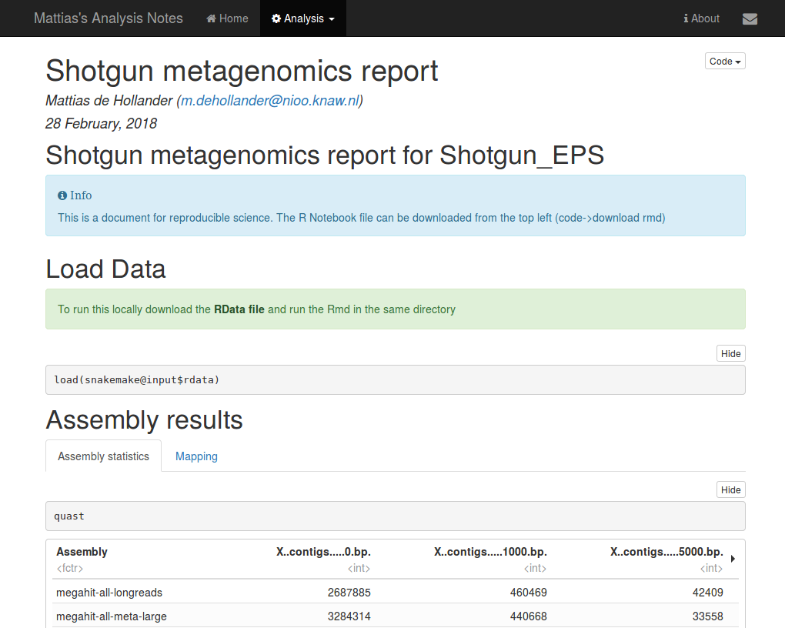

## Orochi

Note, this is a work-in-progress pipeline, so contact bioinformatics-support@nioo.knaw.nl for more information. Currenty work is done to reorganize the pipeline into [modules] (https://gitlab.bioinf.nioo.knaw.nl/pipelines/orochi/tree/modules) and to create a interactive report written in [R Notebooks](https://blog.rstudio.com/2016/10/05/r-notebooks). Contributions are highly welcome.

### Please cite as
[](https://zenodo.org/badge/latestdoi/190360037)


### Getting started

1. Logon to the place where you will analysis your data, e.g. server
2. Create a local copy of the pipeline in a project folder
```
git clone https://gitlab.bioinf.nioo.knaw.nl/pipelines/orochi
``` 
3. Enter your (NIOO) username and password

This will create a local copy of the pipeline in a folder called `orochi`

4. Enter the pipeline folder with `cd orochi`

5. The configuration of the pipeline needs to be set in a file called `config.json`. There is an example file which you can copy and adjust
```
cp config.sample.json config.json
```

Take a look at the `config.json` file

6. Adjust settings like:
   - project name
   - host genome
   - data files
   - treatment/assembly groups

7. Check if the config file is correct and which steps will be run
```
snakemake -n
```

8. Run the pipeline. `-j` specifies the number of threads. Conda is the package manager
```
snakemake -j 8 --use-conda
```

8. Look at a diagram of all the steps in the workflow

```
snakemake --rulegraph | dot -Tpng > workflow.png
display workflow.png
```

### Example Report
[](http://nioo0025.nioo.int/~mattiash/orochi.report.nb.html "Example report Orochi pipeline - Click to open!")